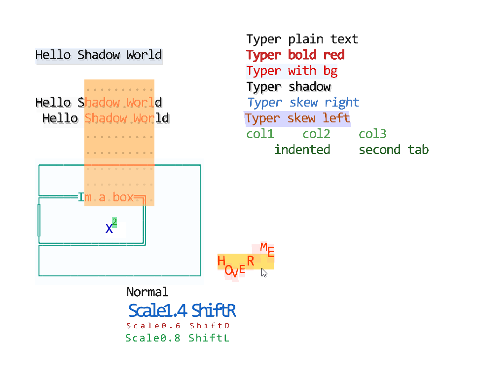
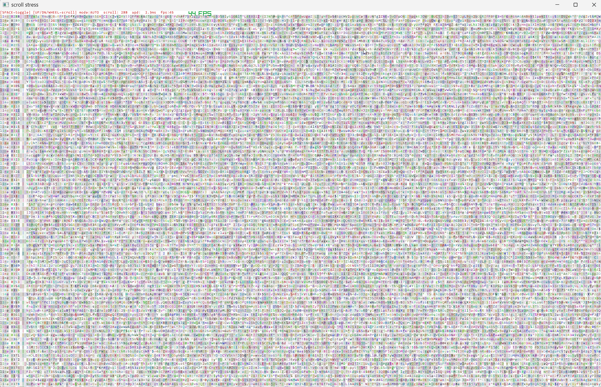

# ni - Terminal UI Library (niche)

A high-performance terminal UI library with GPU-accelerated rendering using OpenGL.




## Features

- GPU-accelerated rendering with shaders
- Region-based layout system
- Built-in UI components (buttons, inputs, file browser, etc.)
- Scrollable regions and text rendering
- SDF (Signed Distance Field) character rendering

### BELOW DOESNT WORK YET. LIB NOT PUBLISHED.

## Installation

```bash
pip install ni-terminal
```

## Quick Start

```python
import ni

# Initialize the renderer
ni.init(win_w=1280, win_h=720, title="My App")

# Create a region
region = ni.Region(cols=80, rows=24)

# Draw something
region.print(0, 0, "Hello, World!")

# Run the main loop
ni.run()
```

## Examples

Check the `examples/` directory for more complex usage:
- `nidemo.py` - Basic demo
- `nidemo_scroll.py` - Scrollable regions demo
- `nidemo_ui2.py` - UI components demo

## Requirements

- Python 3.10+
- OpenGL-compatible GPU
- numpy

## License

MIT License
